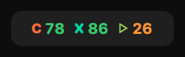
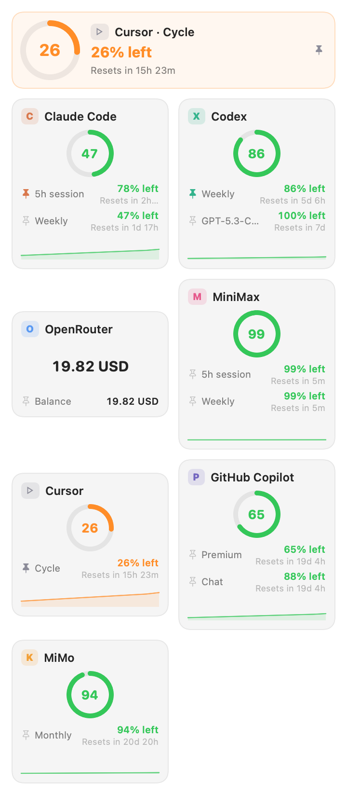
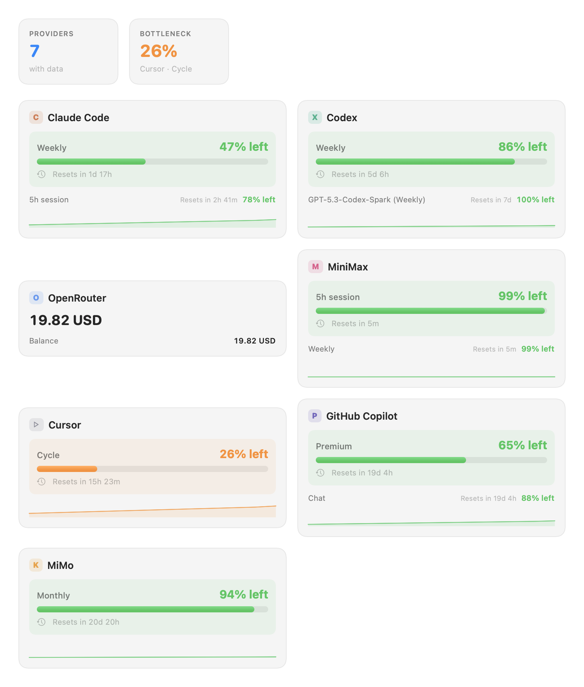
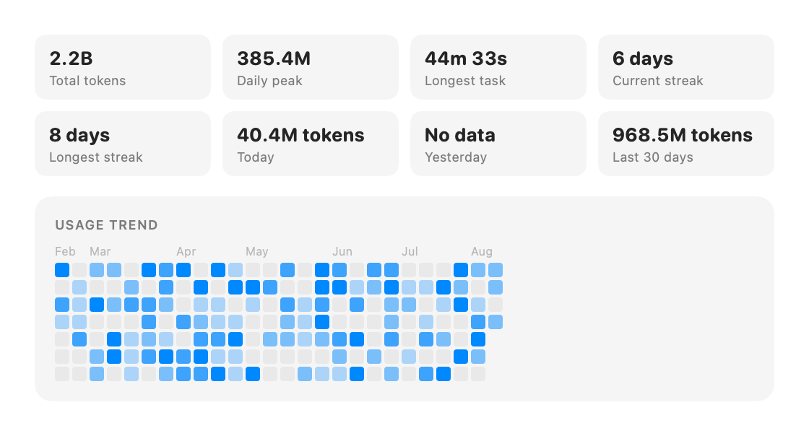
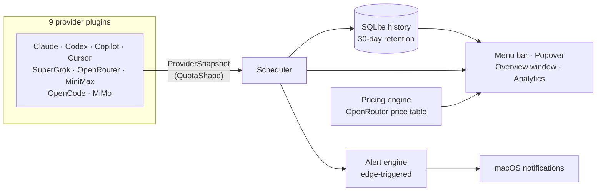

<div align="center">

# OkTally

**Every AI coding subscription quota, in your macOS menu bar — before you hit the wall.**

[](https://www.apple.com/macos/)
[](https://swift.org)
[](https://developer.apple.com/xcode/swiftui/)
[](LICENSE)
[](https://github.com/OkamiOps/OkTally/releases)
[](#development)
[](#privacy)

**English** | [Deutsch](README.de.md) | [Français](README.fr.md) | [Português (BR)](README.pt-BR.md)

<br />



<br />
<br />



<sub>All screenshots use demo data.</sub>

</div>

---

## Why OkTally

Subscription AI tools don't warn you. Claude Code's 5-hour window closes mid-refactor, the weekly cap lands on a Thursday, and the first sign of trouble is a *"you've reached your limit"* message. Meanwhile the quota you *do* have sitting on another subscription goes unused, because nothing tells you it's there.

OkTally is a **native macOS menu bar app** that keeps every one of those quotas visible at a glance — one colored strip in the menu bar, one popover with the full picture, a full overview window with usage analytics, and a notification **before** you run out instead of after.

## Features at a glance

| | Feature | What it does |
| :-: | --- | --- |
| 📌 | **Colored menu bar pins** | Pin any number of quota windows; each renders as `C 78 · X 86 · ▹ 26` — glyph in the provider's color, % remaining colored by urgency |
| 🎯 | **Bottleneck-first popover** | A hero gauge spotlights the window closest to running out, with reset countdown; two-column provider cards with ring gauges below |
| 📈 | **24h sparklines** | Every provider card carries a mini trend of the last 24 hours, straight from the local history database |
| 🪟 | **Overview window** | Sidebar navigation, KPI row (providers · bottleneck · estimated cost), capsule bars per window, 7-day trends per provider |
| 📊 | **Analytics tab** | Token stats + GitHub-style usage heatmap, aggregated across Codex, Claude Code and OpenCode — streaks, daily peak, today/yesterday/30 days |
| 🔔 | **Configurable alerts** | Edge-triggered macOS notifications at 70/90/100% (your pick) and a low-balance USD threshold — once per crossing, not once per poll |
| 💰 | **Cost estimates** | Local token counts × OpenRouter's public price table → "est. cost (30d)" on the card |
| 🧲 | **Zero-config detection** | Cursor and GitHub Copilot are picked up from the logins already on your Mac — nothing to paste |
| 🔐 | **Keychain-only secrets** | OAuth tokens and API keys never touch plaintext; everything runs locally |

## The overview window

<div align="center">

</div>

Open it from the popover ("Visão geral"). The sidebar lists every provider with a live status dot; the main grid puts each provider's **most constrained window first** — tinted hero block, capsule bar, reset countdown — with the remaining windows collapsed into compact rows and a 7-day sparkline underneath.

## The analytics tab

<div align="center">

</div>

One panel that answers *"how much am I actually using?"* across every source that exposes token data:

| Source | Where the numbers come from | Notes |
| --- | --- | --- |
| **Codex** | ChatGPT account stats API | True lifetime tokens, longest task, streaks |
| **Claude Code** | Local session transcripts (`~/.claude/projects`) | Incremental per-file cache — first scan of a large corpus takes a moment, afterwards <0.1s |
| **OpenCode** | Local session database | Tokens per day including cache/reasoning |

The **Análise** tab sums all sources into one heatmap + stat chips (lifetime, daily peak, current/longest streak, today, yesterday, last 30 days), with a per-provider breakdown below. Local numbers are honest estimates of what's on your machine — not a bill.

## Providers

| Provider | Auth | Quota windows | Analytics | Cost est. |
| --- | --- | --- | :-: | :-: |
| **Claude Code** | OAuth, or one-click import of your existing CLI login | 5h session + weekly (+ Opus weekly) | ✅ local | — |
| **Codex** | OAuth | Weekly + per-feature windows (e.g. Spark) | ✅ account | — |
| **GitHub Copilot** | **Zero-config** — reads your Copilot/gh CLI login | Chat, completions, premium | — | — |
| **Cursor** | **Zero-config** — reads your local Cursor session | Balance + billing-cycle % | — | — |
| **SuperGrok** | OAuth device code | Weekly window | — | — |
| **OpenRouter** | API key | Credit balance | — | price table source |
| **MiniMax** | API key (global or China region) | 5h + weekly, worst-model-wins | — | — |
| **OpenCode** | API key + local database | 5h / weekly / monthly (estimated) | ✅ local | ✅ |
| **MiMo** | In-app web session (self-recovering) or manual estimate | Monthly plan | — | — |

**Self-recovering MiMo session.** The Xiaomi console session lives in a persistent in-app web view. When its short-lived STS cookie expires, OkTally transparently reloads the console and retries — you only log in again if the underlying Xiaomi SSO session actually dies.

**Schema-drift tolerant.** These are mostly undocumented APIs. OkTally decodes only the fields it consumes, treats them as optional whenever live traffic has shown `null`, and keeps showing the **last known good data** (with an "updated X ago" caption) when a poll fails.

## How it works



Every provider is a plugin conforming to a single `UsageProvider` protocol and normalizes its data into one `QuotaShape` model — rolling window, periodic counter, credit balance, metered, or estimated — so the UI never has to special-case a vendor.

## Install

### DMG (recommended)

1. Download `OkTally-0.9.0.dmg` from the [Releases page](https://github.com/OkamiOps/OkTally/releases).
2. Open it and drag **OkTally** to Applications.
3. The app is not notarized: on first launch, right-click (Ctrl-click) `OkTally.app` → **Open** → **Open**.

### Build from source

Requires Xcode Command Line Tools with Swift 5.9 or newer.

```bash
git clone https://github.com/OkamiOps/OkTally.git
cd OkTally
bash Scripts/build_app.sh    # builds .build/OkTally.app
```

Optional extras:

```bash
bash Scripts/install_launch_agent.sh   # start OkTally at login
bash Scripts/make_dmg.sh               # package a drag-to-install DMG
```

> **Stable signing:** `build_app.sh` automatically signs with a stable identity — a self-signed `OkTally Dev` certificate if you created one, otherwise any **Apple Development** certificate already on the machine. Only when neither exists does it fall back to an ad-hoc signature, which changes the app's identity on every build and forces you to log in to providers again after each rebuild.

## Getting started

1. Click the OkTally item in the menu bar — first launch shows a **connect your first provider** call-to-action.
2. Open **Preferences** and connect each provider you use — OAuth login, API key, or nothing at all for Cursor/Copilot.
3. Back in the popover, pin the windows you care about with the pin icon.
4. Tune alert thresholds (70/90/100% + low balance) in **Preferences → General**.
5. Open **Visão geral** for the full dashboard and the **Análise** tab.

## Development

```bash
swift test    # 235 unit tests
```

| Directory | What lives there |
| --- | --- |
| `Sources/OkTally/Core` | `QuotaShape`, scheduler, alert engine, history & analytics models — pure and unit-tested |
| `Sources/OkTally/Plugins` | One folder per provider; each normalizes into `ProviderSnapshot` |
| `Sources/OkTally/UI` | Popover, overview window, heatmap, sparkline, palette — presentation logic in pure models |
| `Sources/OkTally/Pricing` | Price table source + cost engine |
| `Sources/OkTally/Storage` | GRDB/SQLite snapshot history with retention |
| `docs/superpowers/` | Design documents and research notes |

## Privacy

Everything runs locally on your Mac.

- OAuth tokens and API keys are stored in the **macOS Keychain**, never in plaintext.
- Usage history lives in a local **SQLite** database, pruned after 30 days.
- Claude Code / OpenCode analytics read files **already on your machine** — nothing is uploaded.
- No telemetry, no analytics, no external servers — OkTally talks only to the providers' own APIs.

## Roadmap

- [x] Plan badges (Pro/Free/Business) on provider cards
- [x] Update check (daily, against GitHub Releases — auto-install waits for notarization)
- [x] Localization (English + Portuguese, follows the system language)
- [ ] More zero-config providers (Gemini CLI, Antigravity, Qwen)
- [ ] Notarized builds

## License

[MIT](LICENSE) © OkamiOps
