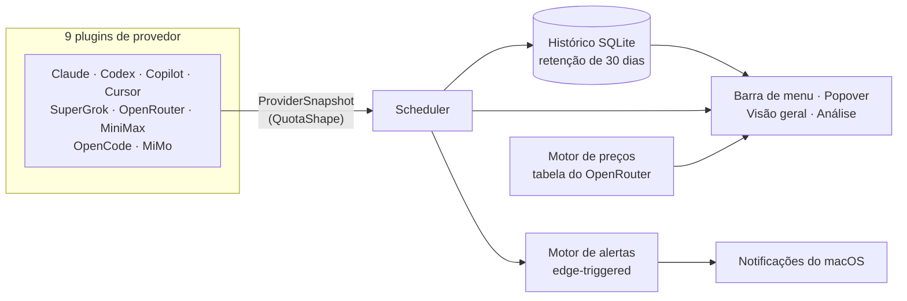

<div align="center">

# OkTally

**Todas as cotas das suas assinaturas de IA na barra de menu do macOS — antes de bater no limite.**

[](https://www.apple.com/macos/)
[](https://swift.org)
[](https://developer.apple.com/xcode/swiftui/)
[](LICENSE)
[](https://github.com/OkamiOps/OkTally/releases)
[](#desenvolvimento)
[](#privacidade)

[English](README.md) | [Deutsch](README.de.md) | [Français](README.fr.md) | **Português (BR)**

<br />


<br />
<br />


<sub>Todos os screenshots usam dados de demonstração.</sub>

</div>

---

## Por que o OkTally

Ferramentas de IA por assinatura não avisam. A janela de 5 horas do Claude Code fecha no meio de um refactor, o teto semanal cai numa quinta-feira, e o primeiro sinal de problema é a mensagem *"você atingiu seu limite"*. Enquanto isso, a cota que você **tem** em outra assinatura fica parada, porque nada te mostra que ela existe.

O OkTally é um app **nativo de barra de menu do macOS** que mantém todas essas cotas visíveis de relance — uma faixa colorida na barra, um popover com o quadro completo, uma janela de visão geral com análise de uso, e uma notificação **antes** de acabar, não depois.

## Recursos num relance

| | Recurso | O que faz |
| :-: | --- | --- |
| 📌 | **Pins coloridos na barra** | Fixe quantas janelas quiser; cada uma vira `C 78 · X 86 · ▹ 26` — glifo na cor do provedor, % restante colorido pela urgência |
| 🎯 | **Popover gargalo-primeiro** | Um gauge-herói destaca a janela mais perto de acabar, com contagem para o reset; cards por provedor com anéis abaixo |
| 📈 | **Sparklines de 24h** | Cada card carrega uma mini-tendência das últimas 24 horas, direto do histórico local |
| 🪟 | **Janela Visão geral** | Sidebar, KPIs (provedores · gargalo · custo estimado), barras em cápsula por janela, tendência de 7 dias por provedor |
| 📊 | **Aba Análise** | Estatísticas de tokens + heatmap estilo GitHub, agregando Codex, Claude Code e OpenCode — streaks, pico diário, hoje/ontem/30 dias |
| 🔔 | **Alertas configuráveis** | Notificações do macOS em 70/90/100% (você escolhe) e limite de saldo baixo em USD — uma vez por cruzamento, não por poll |
| 💰 | **Custo estimado** | Tokens locais × tabela pública de preços do OpenRouter → "Custo est. (30d)" no card |
| 🧲 | **Detecção zero-config** | Cursor e GitHub Copilot são detectados dos logins que já existem no seu Mac — nada para colar |
| 🔐 | **Segredos só no Keychain** | Tokens OAuth e chaves de API nunca ficam em texto puro; tudo roda localmente |

## A janela Visão geral

<div align="center">

</div>

Abra pelo popover ("Visão geral"). A sidebar lista cada provedor com um dot de status ao vivo; a grade principal coloca a **janela mais apertada de cada provedor em primeiro** — bloco-herói tingido, barra em cápsula, contagem para o reset — com as demais janelas em linhas compactas e um sparkline de 7 dias abaixo.

## A aba Análise

<div align="center">

</div>

Um painel que responde *"quanto eu realmente uso?"* em todas as fontes que expõem tokens:

| Fonte | De onde vêm os números | Observações |
| --- | --- | --- |
| **Codex** | API de estatísticas da conta (ChatGPT) | Tokens lifetime reais, tarefa mais longa, streaks |
| **Claude Code** | Transcritos locais (`~/.claude/projects`) | Cache incremental por arquivo — o 1º scan de um corpus grande demora um pouco; depois <0,1s |
| **OpenCode** | Banco local de sessões | Tokens por dia incluindo cache/reasoning |

A aba **Análise** soma todas as fontes num único heatmap + chips (total, pico diário, streak atual/maior, hoje, ontem, 30 dias), com recorte por provedor abaixo. Números locais são estimativas honestas do que está na sua máquina — não uma fatura.

## Provedores

| Provedor | Autenticação | Janelas de cota | Análise | Custo |
| --- | --- | --- | :-: | :-: |
| **Claude Code** | OAuth, ou importação em um clique do login do CLI | Sessão 5h + semanal (+ Opus semanal) | ✅ local | — |
| **Codex** | OAuth | Semanal + janelas por recurso (ex.: Spark) | ✅ conta | — |
| **GitHub Copilot** | **Zero-config** — lê o login do Copilot/gh CLI | Chat, autocomplete, premium | — | — |
| **Cursor** | **Zero-config** — lê a sessão local do Cursor | Saldo + % do ciclo | — | — |
| **SuperGrok** | OAuth device code | Janela semanal | — | — |
| **OpenRouter** | Chave de API | Saldo de créditos | — | fonte da tabela |
| **MiniMax** | Chave de API (global ou China) | 5h + semanal, pior-modelo-vence | — | — |
| **OpenCode** | Chave de API + banco local | 5h / semanal / mensal (estimado) | ✅ local | ✅ |
| **MiMo** | Sessão web no app (auto-recuperável) ou estimativa manual | Plano mensal | — | — |

**Sessão MiMo auto-recuperável.** A sessão do console Xiaomi vive numa web view persistente dentro do app. Quando o cookie STS de curta duração expira, o OkTally recarrega o console e tenta de novo de forma transparente — você só loga de novo se o SSO da Xiaomi morrer de verdade.

**Tolerante a drift de schema.** São APIs em boa parte não documentadas. O OkTally decodifica só os campos que consome, trata como opcional o que o tráfego real já mostrou `null`, e mantém o **último dado bom** na tela (com "Atualizado há X") quando um poll falha.

## Como funciona



Cada provedor é um plugin que implementa um único protocolo `UsageProvider` e normaliza seus dados num único modelo `QuotaShape` — janela deslizante, contador periódico, saldo de créditos, medido ou estimado — para a UI nunca precisar tratar um fornecedor como caso especial.

## Instalação

### DMG (recomendado)

1. Baixe `OkTally-0.9.0.dmg` na [página de Releases](https://github.com/OkamiOps/OkTally/releases).
2. Abra e arraste **OkTally** para Aplicativos.
3. O app não é notarizado: no primeiro uso, clique com o botão direito (Ctrl-clique) em `OkTally.app` → **Abrir** → **Abrir**.

### Compilar do código

Requer Xcode Command Line Tools com Swift 5.9 ou mais novo.

```bash
git clone https://github.com/OkamiOps/OkTally.git
cd OkTally
bash Scripts/build_app.sh    # gera .build/OkTally.app
```

Extras opcionais:

```bash
bash Scripts/install_launch_agent.sh   # iniciar o OkTally no login
bash Scripts/make_dmg.sh               # empacotar um DMG de arrastar-e-soltar
```

> **Assinatura estável:** o `build_app.sh` assina automaticamente com uma identidade estável — o certificado autoassinado `OkTally Dev` se você criou um, senão qualquer certificado **Apple Development** já presente na máquina. Só quando nenhum dos dois existe ele cai para assinatura ad-hoc, que muda a identidade do app a cada build e força novo login nos provedores após cada rebuild.

## Primeiros passos

1. Clique no item do OkTally na barra de menu — o primeiro uso mostra a chamada **conecte seu primeiro provedor**.
2. Abra as **Preferências** e conecte cada provedor que você usa — login OAuth, chave de API, ou nada no caso de Cursor/Copilot.
3. De volta ao popover, fixe as janelas que importam com o ícone de alfinete.
4. Ajuste os limites de alerta (70/90/100% + saldo baixo) em **Preferências → Geral**.
5. Abra a **Visão geral** para o painel completo e a aba **Análise**.

## Desenvolvimento

```bash
swift test    # 235 testes unitários
```

| Diretório | O que mora lá |
| --- | --- |
| `Sources/OkTally/Core` | `QuotaShape`, scheduler, motor de alertas, modelos de histórico e análise — puros e testados |
| `Sources/OkTally/Plugins` | Uma pasta por provedor; cada uma normaliza em `ProviderSnapshot` |
| `Sources/OkTally/UI` | Popover, janela, heatmap, sparkline, paleta — lógica de apresentação em modelos puros |
| `Sources/OkTally/Pricing` | Fonte da tabela de preços + motor de custos |
| `Sources/OkTally/Storage` | Histórico de snapshots GRDB/SQLite com retenção |
| `docs/superpowers/` | Documentos de design e notas de pesquisa |

## Privacidade

Tudo roda localmente no seu Mac.

- Tokens OAuth e chaves de API ficam no **Keychain do macOS**, nunca em texto puro.
- O histórico de uso vive num banco **SQLite** local, podado após 30 dias.
- A análise de Claude Code / OpenCode lê arquivos **que já estão na sua máquina** — nada é enviado.
- Sem telemetria, sem analytics, sem servidores externos — o OkTally fala só com as APIs dos próprios provedores.

## Roadmap

- [x] Badges de plano (Pro/Free/Business) nos cards
- [x] Verificação de atualização (diária, via GitHub Releases — auto-instalação espera a notarização)
- [x] Localização (inglês + português, segue o idioma do sistema)
- [ ] Mais provedores zero-config (Gemini CLI, Antigravity, Qwen)
- [ ] Builds notarizadas

## Licença

[MIT](LICENSE) © OkamiOps
